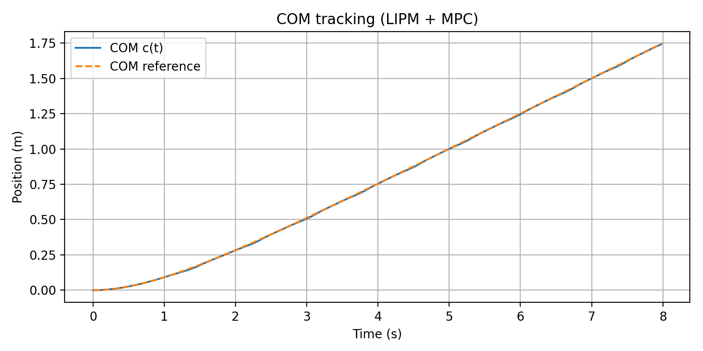
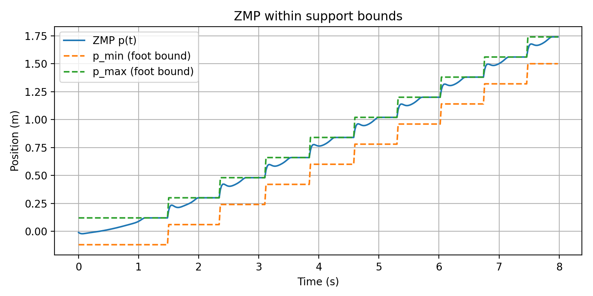

# LIPM + ZMP + MPC (1D) 

This project implements a 1D Linear Inverted Pendulum Model (LIPM) and uses Model Predictive Control (MPC) to generate a ZMP trajectory that stays within foot support bounds while tracking a desired COM motion.

## Key Ideas
- **LIPM dynamics:**  c̈ = ω² (c − p),  ω = sqrt(g/h)
- **Control input:** ZMP position p(t)
- **Constraint:** ZMP must remain inside the support interval (1D foot polygon)
- **MPC:** solves a QP at each time step to track COM position/velocity while enforcing ZMP bounds

## What’s Included
- `lipm_zmp_mpc.ipynb`: full implementation (simulation + MPC)
- `outputs/`: generated plots:
  - COM tracking
  - ZMP within support bounds
  - velocity tracking

## Results
### COM tracking


### ZMP constraint satisfaction


### Velocity tracking


## How to Run
### Option A: Jupyter
1. Create and activate a virtual environment (optional)
2. Install requirements:
```bash
pip install -r requirements.txt
